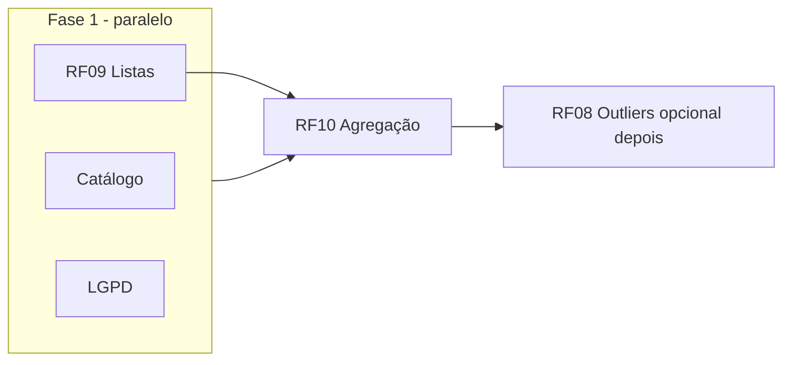

# Plano backend — trabalho paralelo (sem app/front)

Objetivo: entregar **listas de compras (RF09)**, **sugestão “onde comprar” por lista (RF10)**, **busca/listagem de produtos**, **outliers (RF08)** e **exclusão de conta LGPD (RF11)**, com mínimo conflito entre agentes.

**Escopo explícito:** apenas `backend/api`, `docs/` de contrato/schema quando necessário. **Não** alterar `frontend/` nem app mobile.

---

## Papéis

| Papel | Responsabilidade |
|--------|------------------|
| **Orquestrador** | Define ordem de merge, resolve sobreposição de arquivos, atualiza contratos neste doc (seções *Contrato*), aponta bloqueios. Não precisa implementar código; pode fazer commits só de doc/coordenação. |
| **Agente Listas (RF09)** | Modelo, migrations, CRUD autenticado de listas e itens. |
| **Agente Catálogo** | Endpoints de busca/listagem de `products_canonical` para o app obter `id` antes de `/prices`. |
| **Agente LGPD (RF11)** | Exclusão de conta + anonimização de `receipts` conforme `schema-banco.md`. |
| **Agente RF10 Preços** | Serviço que agrega totais/ranking por loja para uma lista; depende do modelo de lista existir. |
| **Agente Outliers (RF08)** | Regras + exposição de flags/disclaimer de preço atípico (coordena com quem mexe em `ProductPricesSummary`). |

---

## Dependências (quem espera quem)

- **Fase 1 (simultânea):** Listas, Catálogo e LGPD **não dependem** uns dos outros (rotas e tabelas diferentes).
- **RF10:** Idealmente começa quando **RF09** já estiver na branch principal ou quando o contrato de `shopping_list_items` estiver fixo neste documento (o agente RF10 pode usar factories alinhadas ao PR de listas).
- **RF08:** Convém **depois** de RF10 ou em branch separada: ambos podem tocar `app/services/pricing/`. Se precisar ser paralelo, dividir por arquivo (ex.: outliers em novo serviço, sem editar o mesmo trecho de `product_prices_summary.rb` no mesmo sprint).

---

## Divisão de arquivos (evitar conflito)

| Área | Preferência de “dono” no sprint |
|------|--------------------------------|
| `config/routes.rb` | Orquestrador **ou** um único commit agregando rotas no fim do dia; agentes adicionam trechos em comentários no STATUS e o orquestrador unifica se necessário. |
| `db/schema.rb` | Gerado por migrations; cada agente só roda migrate na sua feature. |
| `docs/api-contrato.md` | Cada agente adiciona **sua seção**; evitar reescrever o mesmo parágrafo. |
| `ProductPricesSummary` | Preferência: **um agente por vez** (RF10 ou Outliers). |

---

## Contrato mínimo (o orquestrador preenche/atualiza após alinhamento)

**Estado (orquestrador):** rascunho; detalhes de tipos JSON e rotas finais entram aqui quando cada agente fechar o contrato no respectivo `STATUS-agente-*.md` e o orquestrador consolidar.

### Lista / itens (RF09) — rascunho

- `ShoppingList` pertence a `User`.
- `ShoppingListItem`: `shopping_list_id`, `product_canonical_id` (opcional), `label` texto (opcional), `quantidade` (decimal), `ordem` ou timestamps.

### RF10 — entrada/saída esperada

- **Entrada:** `shopping_list_id` (via rota) **ou** payload explícito com array `{ product_canonical_id, quantidade }` para testes.
- **Saída:** lista ordenada de lojas com `store_id`, `nome`, `cnpj`, `estimated_total` (string decimal), `lines_covered` / `lines_missing_price`, critérios iguais ao `ProductPricesSummary` (janela 30 dias, ≥2 notas por loja para incluir preço daquele produto naquela loja).

*(O orquestrador detalha tipos JSON aqui quando RF09 estiver mergeado.)*

---

## Fluxo simultâneo recomendado

1. **Dia/sprint 1 — três agentes em paralelo**
   - **Listas:** migrations + modelos + controller + testes.
   - **Catálogo:** `GET /products` com `q=` e paginação + testes.
   - **LGPD:** destroy account + testes de anonimização.

2. **Sprint 2 — um agente (RF10)**  
   - Implementa serviço + rota (ex. `GET` ou `POST` para “melhor loja” para `shopping_list_id`).  
   - Rebase na branch que já tem RF09.

3. **Sprint 3 — outliers (opcional)**  
   - Serviço novo ou extensão controlada de resposta JSON; testes.

O **orquestrador** marca em `STATUS-orquestrador.md` qual branch base cada um deve usar (`main` / `backend`) e quando fazer merge.

---

## Critérios de pronto

- Testes automatizados (`bin/rails test`) passando com `DATABASE_URL` apontando para `api_test` quando usar Docker (ver nota no `backend/api/README.md` se existir).
- `api-contrato.md` atualizado para cada endpoint novo.
- Arquivo `STATUS-agente-*.md` preenchido com “Concluído” e lista de arquivos tocados.

---

## Após concluir o projeto backend

- Atualizar `docs/schema-banco.md` e `docs/parecer-projeto-faculdade.md` (status de implementação).
- Opcional: OpenAPI.
