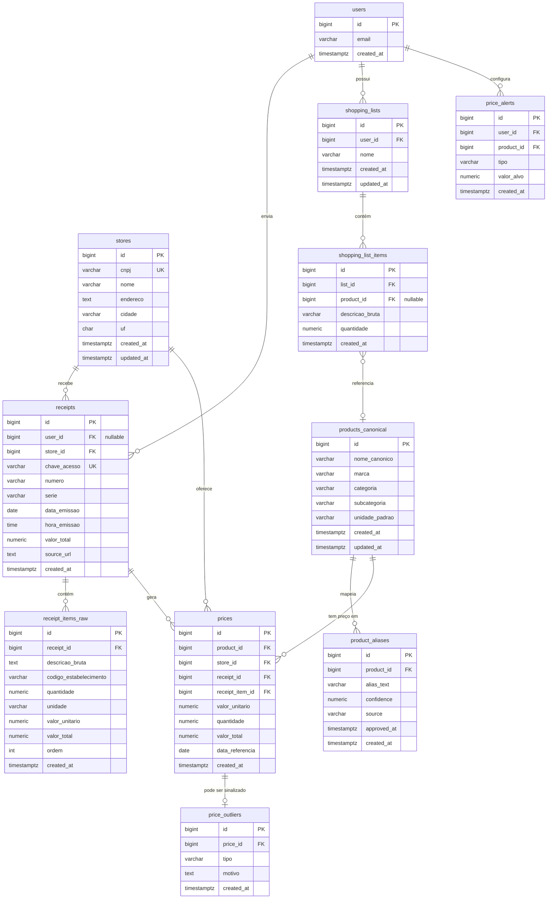

# Objetivos, justificativa, requisitos, modelo ER e casos de uso

> **English readers:** This document stays in Portuguese (academic brief). For the **implemented API and database**, see [api-contrato.md](api-contrato.md) and [schema-banco.md](schema-banco.md) (English).

Documento único com: objetivos e justificativa do projeto, requisitos funcionais e não funcionais, diagrama ER e casos de uso / fluxos.

---

## 1. Objetivos e justificativa

### Problema

Consumidores têm dificuldade em comparar preços entre mercados: as informações estão dispersas (notas fiscais, cupons, sites) e não há um histórico único por produto e por estabelecimento para decidir onde comprar. Ao mesmo tempo, as NFC-e (notas fiscais de consumidor eletrônicas) contêm dados estruturados (itens, preços, mercado) que, se agregados e normalizados, podem sustentar um serviço de comparação e sugestão de compras.

### Objetivo geral

Oferecer um aplicativo em que o usuário escaneie o QR da NFC-e, o sistema normalize produtos e preços a partir das notas enviadas por todos os usuários e sugira onde fazer as compras, com listas de compras e exibição de preço por mercado (incluindo histórico e preço relevante).

### Objetivos específicos

1. Permitir o envio da nota fiscal (QR/URL da NFC-e) pelo app e o armazenamento dos dados brutos no backend.  
2. Processar e normalizar itens de notas (regras + LLM) para um catálogo canônico de produtos e manter histórico de preços por produto e por mercado.  
3. Exibir, por produto, o preço relevante e o histórico (por período) em cada mercado, com indicação de preços muito abaixo do normal (possível promoção ou desconto pontual).  
4. Permitir listas de compras e calcular a sugestão de “onde é melhor comprar” com base no preço relevante (≥2 notas quando existir).  
5. Garantir que, em caso de exclusão de conta ou pedido de exclusão de dados (LGPD), apenas os dados que identificam o usuário sejam removidos, mantendo notas e histórico de preços anonimizados.

### Justificativa

A comparação de preços entre mercados melhora a decisão de compra e o poder de consumo das famílias. As NFC-e já são realidade no varejo brasileiro e permitem obter dados reais de preços sem depender de cadastros manuais. Um sistema que agregue essas notas, normalize descrições de produtos e calcule preços representativos (com regras como “pelo menos 2 notas”) gera valor para o consumidor e diferencia o produto em relação a soluções genéricas de listas sem base em dados reais.

### Público-alvo

Consumidores que fazem compras em supermercados e mercados e desejam comparar preços, montar listas e saber onde comprar com melhor custo-benefício, a partir dos dados das próprias notas fiscais e das notas enviadas por outros usuários.

---

## 2. Requisitos

### Requisitos funcionais

| ID   | Descrição |
|------|------------|
| RF01 | O usuário deve poder criar conta e fazer login (identificação por e-mail). |
| RF02 | O usuário deve poder escanear ou informar o QR/URL da NFC-e para envio da nota ao sistema. |
| RF03 | O sistema deve armazenar os dados brutos da nota (emitente, itens, valores) e enfileirar processamento para normalização. |
| RF04 | O sistema deve normalizar descrições de itens (regras e/ou LLM) e vincular a um catálogo canônico de produtos. |
| RF05 | O sistema deve registrar preços por produto, mercado e data, mantendo histórico. |
| RF06 | O sistema deve calcular o “preço relevante” por produto e mercado (valor com ≥2 notas no período, preferindo o mais recente). |
| RF07 | O usuário deve poder consultar, por produto, o preço relevante e o histórico (por período) em cada mercado. |
| RF08 | O sistema deve sinalizar preços muito abaixo do normal (outlier) e exibi-los com disclaimer (possível promoção ou desconto pontual). |
| RF09 | O usuário deve poder criar e editar listas de compras (itens e quantidades). |
| RF10 | O sistema deve sugerir “onde é melhor comprar” com base na soma do preço relevante dos itens da lista por mercado. |
| RF11 | O usuário deve poder solicitar exclusão de conta; o sistema deve remover dados que o identifiquem e anonimizar o vínculo das notas (manter notas e preços). |

### Requisitos não funcionais

| ID   | Descrição |
|------|------------|
| RNF01 | O sistema deve permitir a exclusão dos dados que identifiquem o usuário conforme LGPD, mantendo notas e histórico de preços anonimizados. |
| RNF02 | O processamento de normalização de notas deve ser assíncrono (worker), de modo a não bloquear a resposta ao envio da nota. |
| RNF03 | Dados de preços e produtos devem ser persistidos em banco relacional (PostgreSQL) com esquema documentado. |
| RNF04 | O app mobile deve consumir apenas a API do backend (sem lógica de negócio pesada no cliente). |

---

## 3. Diagrama ER (modelo entidade-relacionamento)

O diagrama abaixo representa as entidades e os relacionamentos descritos no [schema do banco](schema-banco.md). Ele pode ser renderizado em qualquer visualizador de Mermaid (GitHub, GitLab, VS Code, etc.).

---

## 4. Casos de uso e fluxos

### Atores

| Ator        | Descrição |
|-------------|-----------|
| **Usuário** | Consumidor que utiliza o app: envia notas, consulta preços, monta listas e usa a sugestão de onde comprar. |
| **Sistema** | Backend (API + Worker): recebe notas, processa, normaliza, persiste e responde consultas. |

### Casos de uso (resumo)

| UC   | Nome                         | Ator    | Descrição resumida |
|------|------------------------------|---------|---------------------|
| UC01 | Criar conta / Login          | Usuário | Identificar-se no app (e-mail). |
| UC02 | Enviar nota (QR/URL NFC-e)  | Usuário | Escanear ou colar URL/QR da NFC-e; sistema armazena e enfileira processamento. |
| UC03 | Processar e normalizar nota  | Sistema | Worker obtém dados da nota, normaliza itens e atualiza catálogo e preços. |
| UC04 | Consultar preços por produto | Usuário | Ver preço relevante e histórico por mercado (por período). |
| UC05 | Criar/editar lista de compras| Usuário | Incluir itens (produto ou texto livre) e quantidades. |
| UC06 | Obter sugestão “onde comprar”| Usuário | Sistema calcula o custo da lista por mercado e sugere o melhor. |
| UC07 | Excluir conta / Dados (LGPD) | Usuário | Remover conta e dados que identifiquem o titular; sistema anonimiza notas e mantém preços. |

### Fluxo principal: envio de nota e consulta de preços

1. Usuário faz login (UC01).  
2. Usuário escaneia o QR da NFC-e ou cola a URL (UC02).  
3. App envia a URL/dados ao backend; API grava nota bruta e enfileira job.  
4. Worker processa a nota: obtém dados da NFC-e, normaliza itens, grava em `receipts`, `receipt_items_raw`, `stores`, `products_canonical` / `product_aliases`, `prices` (UC03).  
5. Usuário consulta um produto e vê preço relevante e histórico por mercado (UC04).  
6. Usuário pode montar uma lista (UC05) e pedir a sugestão de onde comprar (UC06).

### Fluxo alternativo: exclusão de conta

1. Usuário solicita exclusão de conta (UC07).  
2. Sistema exclui registro em `users`, listas e alertas do usuário.  
3. Sistema anonimiza notas: `receipts.user_id = NULL` para todas as notas daquele usuário.  
4. Notas e histórico de preços permanecem no sistema para uso agregado.
